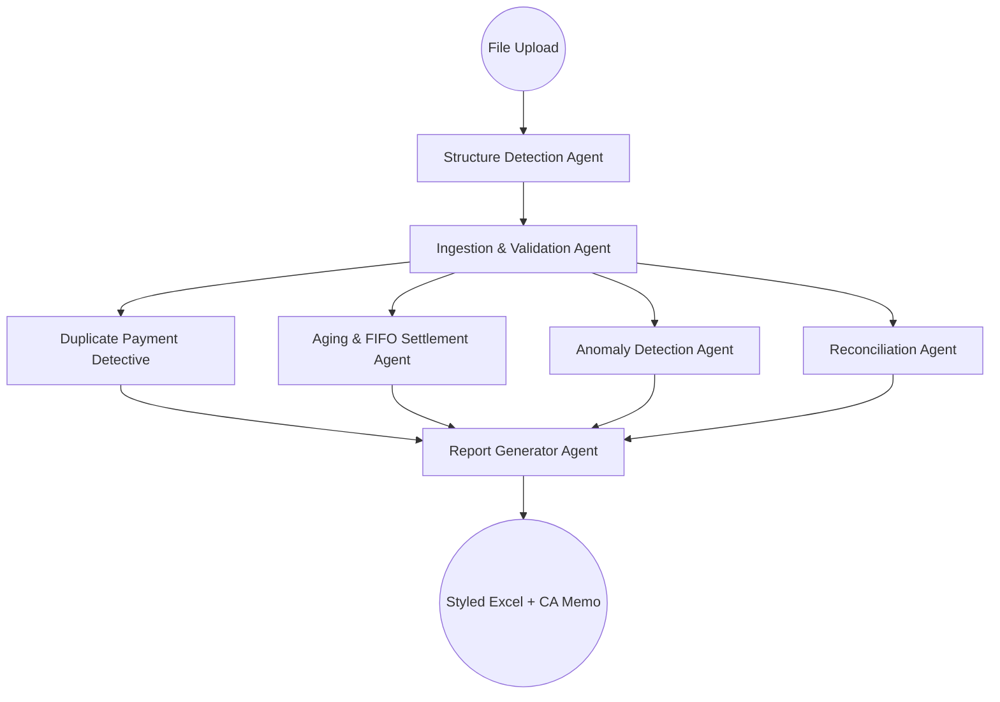

# Forensic Audit Agent System Architecture

This document maps out the multi-agent design, orchestration topography, state models, and execution boundaries for the General Ledger Forensic Audit system.

## System Topography

The system utilizes a structured **LangGraph StateGraph** as its master orchestrator to route data flows deterministically while allowing parallel forensic analysis.

## Specialized Roles

### 1. Structure Detection Agent (`structure_detector.py`)
*   **Role**: Column configuration mapping, metadata extraction, format auto-detection.
*   **Methodology**: Applies scoring-based rule heuristics to match columns. Falls back to an LLM query if column headings are highly ambiguous or non-standard.

### 2. Ingestion & Validation Agent (`ingestion.py`)
*   **Role**: Text data cleaning, numeric parsing, date validation, and record normalization.
*   **Methodology**: Parses amounts to `Decimal`, resolves merged row-headers (ffill/bfill), detects transaction signs (Debit/Credit from combined columns), and flags parsing failures.

### 3. Duplicate Payment Detective Agent (`duplicate_detector.py`)
*   **Role**: Multi-pass pattern scanner for identifying financial leakage.
*   **Methodology**: Runs 5 separate duplicate payment checks (exact duplicate, voucher reference multi-hits, same day same amount, fuzzy amount within 1%, and round numbers without invoice backing).

### 4. Aging & FIFO Settlement Agent (`aging_fifo.py`)
*   **Role**: FIFO cash-matching and receivable/payable ledger aging.
*   **Methodology**: Iteratively settles outstanding bills (debits for debtors, credits for creditors) with receipts/payments in chronological order, putting outstanding values into 6 standard aging buckets.

### 5. Anomaly Detection Agent (`anomaly_detector.py`)
*   **Role**: Security compliance auditor and fraud detection agent.
*   **Methodology**: Inspects transactions against 10 risk vectors (Ghost payments, holiday transactions, split payment approval limit bypasses, segregation of duties user concentrations, round trips, same/next day reversals, etc.).

### 6. Reconciliation Agent (`reconciliation.py`)
*   **Role**: Independent math check and variance validator.
*   **Methodology**: Recalculates the cumulative running balance step-by-step from the opening balance, compares values against the stated balance column, flags discrepancies > Rs. 1, and logs overpayment intervals (negative balance periods).

### 7. Report Generator Agent (`report_generator.py`)
*   **Role**: Document compiler and CA observation memo author.
*   **Methodology**: Writes a styled, color-coded Excel workbook via `openpyxl`. Calls the LLM to read all audit observations and write a formal CA-style memo.

---

## Shared State Schema

Agents communicate through a single TypedDict state context:

| Field Name | Type | Description |
| :--- | :--- | :--- |
| `file_path` | `str` | Absolute path of the uploaded file on the local filesystem. |
| `as_on_date` | `dt.date` | Date boundary for calculating invoice age (default is last txn date). |
| `currency_symbol` | `str` | Currency sign (default "Rs."). |
| `status_updates` | `List[Dict]` | Reducer-accumulated SSE status event logs. |
| `schema_map` | `SchemaMap` | Discovered column layout configuration. |
| `transactions` | `List[NormalizedTransaction]` | Clean parsed transaction records. |
| `duplicates` | `List[DuplicateFinding]` | Flagged duplicate transactions. |
| `aging` | `List[PartyAgingSummary]` | Aging schedules and unsettled flags. |
| `anomalies` | `List[AnomalyFinding]` | Forensic flags with severity ratings. |
| `reconciliation` | `List[ReconciliationPartySummary]` | Running balance checks and variances. |
| `memo` | `AuditMemoModel` | CA observation memo contents. |

---

## Execution Boundaries & Approvals

This system runs completely **locally on the desktop** for privacy and security:
1.  **Spreadsheet Processing**: Excel reading, parsing, FIFO calculations, and database records remain on localhost (SQLite).
2.  **LLM Observations Memo**: Summarized numbers (counts, balances) are sent to the LLM. No raw customer list or transaction narrations are exported to the cloud.
